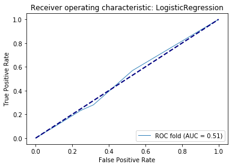
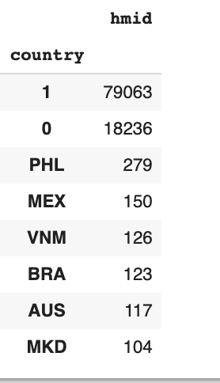
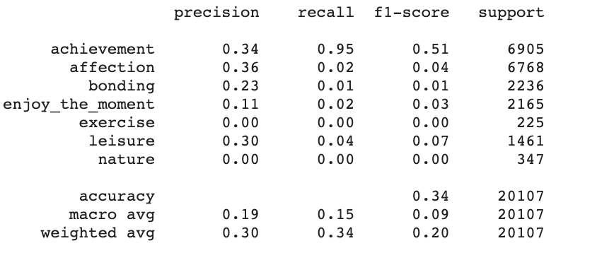
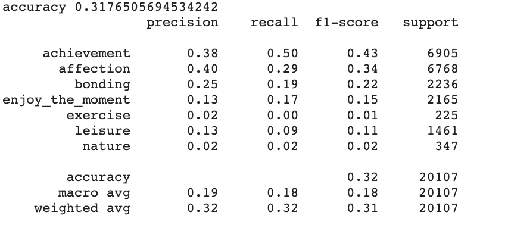

<html><head><meta content="text/html; charset=UTF-8" http-equiv="content-type"><link rel="stylesheet" href="style.css"></head><body class="c32 c80"><h1 class="c29 c95" id="h.itm4oq9rjl68">&nbsp;&nbsp;&nbsp;&nbsp;&nbsp;&nbsp;&nbsp;&nbsp;</h1>

Project Report - CMPE 256

Large Scale Analytics
<h1 class="c43 c56 c116" id="h.q19tfdqxzdfa">Determining the type of Happy Moments using Natural Language Processing and Classification techniques</h1>

11.20.2019

Submitted to: Prof. Magdalini Eirinaki

Submitted By -&nbsp;

Hansraj Pabbati (SJSU ID : 012540541)

Neha Bindle (SJSU ID: 013763126)

Shrey Patel (SJSU ID: 012430652)
<h1 class="c33 c56 c74" id="h.i06pqmmpkdnd"></h1><h1 class="c29" id="h.l9x4hy5be2x7">Table of Contents</h1>
&nbsp; 

<a class="c23" href="#h.itm4oq9rjl68">Chapter &nbsp;1 Introduction</a>&nbsp;&nbsp;&nbsp;&nbsp;&nbsp;&nbsp;&nbsp;&nbsp;<a class="c23" href="#h.itm4oq9rjl68">1</a>

<a class="c23" href="#h.i8f8z6gkw88o">Motivation</a>&nbsp;&nbsp;&nbsp;&nbsp;&nbsp;&nbsp;&nbsp;&nbsp;<a class="c23" href="#h.i8f8z6gkw88o">1</a>

<a class="c23" href="#h.fnjk6vnqzbqk">Chapter &nbsp;2 System Design and Implementation</a>&nbsp;&nbsp;&nbsp;&nbsp;&nbsp;&nbsp;&nbsp;&nbsp;<a class="c23" href="#h.fnjk6vnqzbqk">1</a>

<a class="c23" href="#h.iwerjkqkfkua">Algorithms</a>&nbsp;&nbsp;&nbsp;&nbsp;&nbsp;&nbsp;&nbsp;&nbsp;<a class="c23" href="#h.iwerjkqkfkua">1</a>

<a class="c23" href="#h.lpv6ciisjqp3">Technologies and Tools</a>&nbsp;&nbsp;&nbsp;&nbsp;&nbsp;&nbsp;&nbsp;&nbsp;<a class="c23" href="#h.lpv6ciisjqp3">2</a>

<a class="c23" href="#h.iizq8rwdfhgx">System Design and Implementation</a>&nbsp;&nbsp;&nbsp;&nbsp;&nbsp;&nbsp;&nbsp;&nbsp;3

<a class="c23" href="#h.k018r6c80a6w">Chapter 3 - Experiments / Proof of Concepts and Evaluations</a>&nbsp; &nbsp; &nbsp; &nbsp; &nbsp; &nbsp; &nbsp; &nbsp; &nbsp; &nbsp; &nbsp; &nbsp; &nbsp; &nbsp; &nbsp; &nbsp; &nbsp; &nbsp; &nbsp; &nbsp; &nbsp; &nbsp; &nbsp; &nbsp; &nbsp; &nbsp; &nbsp; &nbsp; &nbsp; &nbsp; &nbsp; &nbsp;4

&nbsp; &nbsp; &nbsp;&nbsp; DataSet Description&nbsp;&nbsp;&nbsp;&nbsp;&nbsp;&nbsp;&nbsp;&nbsp;4

&nbsp; &nbsp; &nbsp; &nbsp;Data Preprocessing&nbsp;&nbsp;&nbsp;&nbsp;&nbsp;&nbsp;&nbsp;&nbsp;4  &nbsp; &nbsp; &nbsp; Methodology&nbsp;&nbsp;&nbsp;&nbsp;&nbsp;&nbsp;&nbsp;&nbsp;5  &nbsp; &nbsp; &nbsp; Graphs&nbsp;&nbsp;&nbsp;&nbsp;&nbsp;&nbsp;&nbsp;&nbsp;6  &nbsp; &nbsp; &nbsp; Analysis of Results&nbsp;&nbsp;&nbsp;&nbsp;&nbsp;&nbsp;&nbsp;&nbsp;

<a class="c23" href="#h.3twgdech7h87">Chapter 4 Discussion &amp; Conclusion</a>&nbsp;&nbsp;&nbsp;&nbsp;&nbsp;&nbsp;&nbsp;&nbsp;9

Chapter 5 Project Plan and Distribution&nbsp;&nbsp;&nbsp;&nbsp;&nbsp;&nbsp;&nbsp;&nbsp;10

References&nbsp;&nbsp;&nbsp;&nbsp;&nbsp;&nbsp;&nbsp;&nbsp;11

Appendix&nbsp;&nbsp;&nbsp;&nbsp;&nbsp;&nbsp;&nbsp;&nbsp;12

<h1 class="c29 c33" id="h.jnu3vzym62g4"></h1><h1 class="c29 c33" id="h.krggs8p5z61e"></h1>

<h1 class="c29" id="h.xwubarirbzg">Chapter 1 - &nbsp;Introduction</h1><h2 class="c31 c56" id="h.i8f8z6gkw88o">Motivation </h2>
What are the factors that contribute to the happiness of the people has always been one of the favorite research topics amongst psychologists. In our project, we are trying to leverage Machine learning and Natural language processing techniques to understand different attributes that affect happiness, and how different demographics are related to different categories of happiness. This is a rich dataset and it gave us the opportunity to predict multiple attributes based on different factors like demographics, and description of the moment

Objective
<ol class="c12 lst-kix_8q2ddkrkiu4a-0 start" start="1"><li class="c31 c26">To predict the category of happiness based on the description of the moment using NLP text classification techniques.</li><li class="c31 c26">To predict demographic variables such as Age, Country, Marital status, Parenthood, the Reflection period, and Gender depending on the description of a happy moment.</li></ol><h1 class="c29" id="h.fnjk6vnqzbqk">Chapter 2 - System Design and Implementation</h1><h2 class="c31 c56" id="h.iwerjkqkfkua">Algorithms&nbsp;</h2>
For predicting the Happiness Category based on Moment Description
<ul class="c12 lst-kix_wupgb8z7etrp-0 start"><li class="c31 c26">Multinomial Naive Bayes&nbsp;- We used MNB as it is best suited for text classification with discrete features.</li><li class="c31 c26">K Nearest Neighbor (KNN)&nbsp;- As it works on a similarity measure, so we tried predicting the category based on the similarity of different input descriptions.</li><li class="c31 c26">SGD Classifier&nbsp;- It works well with data represented as dense or sparse arrays of floating-point values for the features which are basically our input after converting the text in the TFIDF sparse matrix.</li><li class="c31 c26">SVM (Linear Kernel)&nbsp;- As it is suitable for multiclass classification, and is memory efficient.</li><li class="c31 c26">XGBoost Classifier - As it is efficient and assumed to gibe better accuracy as compared to other algorithms. It can very well handle parallel processing, missing values, regularization, and Cross-Validation.</li><li class="c31 c26">Logistic Regression - </li><li class="c31 c26">&nbsp;RNN for Text Classification&nbsp;- Regular ML classifiers were not giving good accuracy so we tried with several deep learning algorithms.</li><li class="c31 c26">LSTM&nbsp;- This performs better than regular deep learning models due to its capability of selectively remembering patterns for long durations of time, thus giving better predictions.</li></ul>
For predicting the Demographic attributes based on Moment Description
<ul class="c12 lst-kix_wupgb8z7etrp-0"><li class="c31 c26">Multinomial&nbsp;Naive Bayes&nbsp;- We used MNB as it is best suited for text classification with discrete features.</li></ul>

For predicting the Age based on multiple attributes
<ul class="c12 lst-kix_wupgb8z7etrp-0"><li class="c31 c26">Decision Tree Regressor&nbsp;&nbsp;- We used a decision tree regressor based on multiple parameters to predict the age. This model is best suited for situations where prediction depends on the presence of an attribute or not. We converted demographics attributes into binary and the decision tree works really well.</li><li class="c31 c26">Random Forest - We used this one to predict the happiness category as well as to find an age range depending on the different parameters combined from two datasets.</li></ul><h2 class="c31 c56" id="h.lpv6ciisjqp3">Technologies and Tools </h2><ol class="c12 lst-kix_8vsi0wpbee47-0 start" start="1"><li class="c31 c26">Scikit Learn, Keras, Tensorflow, Spacy, NLTK and NLP, Matplotlib, Wordcloud, Pandas, Numpy, Google Colab, Seaborn, HPC</li></ol><h2 class="c31 c56" id="h.iizq8rwdfhgx">System Design and Implementation</h2>
The most challenging part of this project was to extract meaningful words from the description of a happy moment. For this task, we worked on the following text-centric features-:
<ul class="c12 lst-kix_wupgb8z7etrp-0"><li class="c31 c26">Structural features: Review length, frequency of most common words.</li><li class="c31 c26">Semantic features: We used a pre-trained model Textblob to find out the polarity and sentiment for the description, and how polarity is related to different categories of happiness.</li><li class="c31 c26">n-gram features: We have extracted unigram, Bigram, Trigram features from the description of happy Moment</li><li class="c31 c26">Converting Categorical attributes into Binary Attributes.</li><li class="c31 c26">Label encoding for predicted category</li></ul>

System Flow for predicting the Happiness Category based on Moment Description

System Flow for predicting the Demographic attributes based on Moment Description

<h1 class="c29" id="h.k018r6c80a6w">Chapter&nbsp;3 - Experiments / Proof of Concepts and Evaluations</h1>
Dataset Description &nbsp;- HappyDB is a dataset of 100535 instances for happy moments crowd-sourced via Amazon&rsquo;s Mechanical Turk. It has two distinct datasets first one containing the description of happy moments and category describing the type of happy moments for 10,843 distinct workers. The second dataset contains the demographic details of those workers who described their happy moments. For our project, we have merged the dataset on the basis of worker ID.

Data Preprocessing 

As this dataset contained both numerical and categorical attributes, so different techniques for preprocessing was required.

Preprocessing steps for Text Data (Description of Happy Moments)
<ul class="c12 lst-kix_hzfw7traqan-0 start"><li class="c24 c26">Removal of regex, stopwords and converting all the text into lower case</li><li class="c24 c26">Dropping the instances with null values</li><li class="c24 c26">Removal of Noise and less meaningful words to get a better analysis</li><li class="c24 c26">Tokenization of sentences using Spacy</li><li class="c24 c26">Stemming and Lemmatization </li><li class="c24 c26">Using Countvectorizer() to convert into a sparse matrix</li><li class="c24 c26">Using TF IDF() to convert the input into CSR Matrix.</li></ul>
Preprocessing steps for Demographic attributes 

For 6 attributes named Age, Gender, Reflection_Period, Country, Parenthood and Marital status we converted each one into binary attributes as described below - 
<ul class="c12 lst-kix_a7sq23dcr71v-0 start"><li class="c31 c26">Age less than 25 as 0, and greater or equal to 25 as 1. For age, there were several records that did not contain the age in the proper format or was nan. Those instances were dropped from the data frame.</li><li class="c24 c26">Parenthood no as 0 and yes as 1.</li><li class="c24 c26">If Single, divorced, Widower or separated &nbsp;as 0, Married as 1</li><li class="c24 c26">For Reflection Period 24 hours as 0, and 3 months as 1</li><li class="c24 c26">For Gender Male as 0 and Female as 1</li><li class="c24 c26">For Country, all the instances from the USA were labeled as 1 and rest everything as 0</li><li class="c24 c26">For predicted category numerical labels were assigned. Exercise - 1, Enjoy_the_moment - 2, achievement - 3, nature - 4, bonding - 5, affection - 6, and leisure - 7.</li><li class="c24 c26">If any instance contained age greater than 125 was dropped.</li><li class="c24 c26">Records containing null values were also dropped.</li></ul>
Methodology - For regular machine learning classification models following are the parameters used -
<ul class="c12 lst-kix_g24rnbp8zk0c-0 start"><li class="c24 c26">For TFIDF - &nbsp;TfidfVectorizer(use_idf=True, min_df=3, max_df=0.5, ngram_range=(1,2) sublinear_tf= True,max_features=5000). These were decided on the basis of Grid Search.</li><li class="c24 c26">KNN - 3 nearest neighbor was used to predict the category.</li><li class="c24 c26">SGD Classifier - Pipeline was made with the following parameters, loss=&#39;hinge&#39;, penalty=&#39;l2&#39;,alpha=1e-3, random_state=42, max_iter=5, tol=None</li><li class="c24 c26">Logistic Regression was performed on the default parameters.</li><li class="c24 c26">RNN used the maximum length of vector as 1000, and the maximum number of words to be considered as 10,000 which was decided on the basis of the total number of words in the dataset. Below mentioned are other parameters used </li><li class="c24 c26"> LSTM - Parameters used were : MAX_NB_WORDS = 50000, MAX_SEQUENCE_LENGTH = 250 EMBEDDING_DIM = 100</li><li class="c24 c26">Train-test split was 80:20. </li><li class="c24 c26">5 fold cross-validation used in Deep learning models.   Graphs</li></ul>

<table class="c110"><tbody><tr class="c30"><td class="c102" colspan="1" rowspan="1">

</td><td class="c54" colspan="1" rowspan="1">

</td></tr><tr class="c30"><td class="c102" colspan="1" rowspan="1">

Before Text Cleaning

</td><td class="c54" colspan="1" rowspan="1">

&nbsp;After Text Cleaning
</td></tr><tr class="c30"><td class="c102" colspan="1" rowspan="1">

</td><td class="c54" colspan="1" rowspan="1">

</td></tr><tr class="c30"><td class="c102" colspan="1" rowspan="1">

</td><td class="c54" colspan="1" rowspan="1">

</td></tr></tbody></table>
MetaData Analysis
<table class="c110"><tbody><tr class="c109"><td class="c25" colspan="1" rowspan="1">

</td></tr><tr class="c105"><td class="c25" colspan="1" rowspan="1">
Descriptive analysis of Description of Happy Moment
</td></tr><tr class="c90"><td class="c25" colspan="1" rowspan="1">
&nbsp; &nbsp; &nbsp; &nbsp; &nbsp;
</td></tr><tr class="c30"><td class="c25" colspan="1" rowspan="1">
&nbsp; &nbsp; &nbsp; &nbsp; &nbsp; &nbsp; &nbsp; &nbsp; &nbsp; &nbsp;Bivariate analysis of Marital Status &nbsp; &nbsp; &nbsp; &nbsp; &nbsp; Boxplot for the length of a sentence with predicted category
</td></tr><tr class="c30"><td class="c25" colspan="1" rowspan="1">

Bivariate analysis of age-ranges and predicted category.

HeatMap to see the correlation between different attributes

<table class="c4"><tbody><tr class="c30"><td class="c93" colspan="1" rowspan="1">

</td><td class="c93" colspan="1" rowspan="1">

</td></tr><tr class="c30"><td class="c93" colspan="1" rowspan="1">
Feature importance for predicting age_range as given by RandomForest Classifier.

</td><td class="c93" colspan="1" rowspan="1">
Box plot for &lsquo;sentiment polarity&rsquo; vs &lsquo;age&rsquo;

</td></tr></tbody></table>

</td></tr><tr class="c30"><td class="c25" colspan="1" rowspan="1">

</td></tr><tr class="c30"><td class="c25" colspan="1" rowspan="1">
The statistical distribution of values for all the numeric attributes
</td></tr></tbody></table>
Analysis of results 

&nbsp; &nbsp;Machine learning models for predicting the Happiness Category based on Moment Description
<table class="c112 c76"><tbody><tr class="c62"><td class="c39" colspan="1" rowspan="1">
Model Used
</td><td class="c48" colspan="1" rowspan="1">
F1 score Regular
</td><td class="c69" colspan="1" rowspan="1">
F1 Score with SMOTE
</td><td class="c46" colspan="1" rowspan="1">
F1 Score with ROS 
</td><td class="c5" colspan="1" rowspan="1">
F1 score with Binary Conversion
</td></tr><tr class="c30"><td class="c39" colspan="1" rowspan="1">
Multinomial Naive Bayes
</td><td class="c48" colspan="1" rowspan="1">
0.39
</td><td class="c69" colspan="1" rowspan="1">
0.36
</td><td class="c46" colspan="1" rowspan="1">
0.36
</td><td class="c5" colspan="1" rowspan="1">
0.60
</td></tr><tr class="c30"><td class="c39" colspan="1" rowspan="1">
SGD
</td><td class="c48" colspan="1" rowspan="1">
0.35
</td><td class="c69" colspan="1" rowspan="1">
0.24
</td><td class="c46" colspan="1" rowspan="1">
0.30
</td><td class="c5" colspan="1" rowspan="1">
0.52
</td></tr><tr class="c30"><td class="c39" colspan="1" rowspan="1">
SVM
</td><td class="c48" colspan="1" rowspan="1">
0.31
</td><td class="c69" colspan="1" rowspan="1">
0.22
</td><td class="c46" colspan="1" rowspan="1">
0.30
</td><td class="c5" colspan="1" rowspan="1">
0.48
</td></tr><tr class="c30"><td class="c39" colspan="1" rowspan="1">
XGBoost
</td><td class="c48" colspan="1" rowspan="1">
0.34
</td><td class="c69" colspan="1" rowspan="1">
0.33
</td><td class="c46" colspan="1" rowspan="1">
0.32
</td><td class="c5" colspan="1" rowspan="1">
0.43
</td></tr><tr class="c30"><td class="c39" colspan="1" rowspan="1">
KNN
</td><td class="c48" colspan="1" rowspan="1">
0.34
</td><td class="c69" colspan="1" rowspan="1">
0.13
</td><td class="c46" colspan="1" rowspan="1">
0.33
</td><td class="c5" colspan="1" rowspan="1">
0.43
</td></tr><tr class="c30"><td class="c39" colspan="1" rowspan="1">
Logistic Regression
</td><td class="c48" colspan="1" rowspan="1">
0.32
</td><td class="c69" colspan="1" rowspan="1">
0.30
</td><td class="c46" colspan="1" rowspan="1">
0.32
</td><td class="c5" colspan="1" rowspan="1">
0.58
</td></tr></tbody></table>

<table class="c76 c112"><tbody><tr class="c30"><td class="c8" colspan="1" rowspan="1">
Model Used
</td><td class="c75" colspan="1" rowspan="1">
ROC Curve Regular
</td><td class="c36" colspan="1" rowspan="1">
ROC with SMOTE
</td><td class="c49" colspan="1" rowspan="1">
ROC with ROS 
</td><td class="c73" colspan="1" rowspan="1">
ROC Binary Conversion
</td></tr><tr class="c111"><td class="c8" colspan="1" rowspan="1">
Multinomial Naive Bayes
</td><td class="c75" colspan="1" rowspan="1">

</td><td class="c36" colspan="1" rowspan="1">

</td><td class="c49" colspan="1" rowspan="1">

</td><td class="c73" colspan="1" rowspan="1">

</td></tr><tr class="c30"><td class="c8" colspan="1" rowspan="1">
SGD
</td><td class="c75" colspan="1" rowspan="1">

</td><td class="c36" colspan="1" rowspan="1">

</td><td class="c49" colspan="1" rowspan="1">

</td><td class="c73" colspan="1" rowspan="1">

</td></tr><tr class="c30"><td class="c8" colspan="1" rowspan="1">
SVM
</td><td class="c75" colspan="1" rowspan="1">

</td><td class="c36" colspan="1" rowspan="1">

</td><td class="c49" colspan="1" rowspan="1">

</td><td class="c73" colspan="1" rowspan="1">

</td></tr><tr class="c30"><td class="c8" colspan="1" rowspan="1">
XGBoost
</td><td class="c75" colspan="1" rowspan="1">

</td><td class="c36" colspan="1" rowspan="1">

</td><td class="c49" colspan="1" rowspan="1">

</td><td class="c73" colspan="1" rowspan="1">

</td></tr><tr class="c30"><td class="c8" colspan="1" rowspan="1">
KNN
</td><td class="c75" colspan="1" rowspan="1">

</td><td class="c36" colspan="1" rowspan="1">

</td><td class="c49" colspan="1" rowspan="1">

</td><td class="c73" colspan="1" rowspan="1">

</td></tr><tr class="c30"><td class="c8" colspan="1" rowspan="1">
Logistic Regression
</td><td class="c75" colspan="1" rowspan="1">

</td><td class="c36" colspan="1" rowspan="1">

</td><td class="c49" colspan="1" rowspan="1">

</td><td class="c73" colspan="1" rowspan="1">

</td></tr></tbody></table>
Deep learning models for predicting the Happiness Category based on Moment Description
<table class="c92"><tbody><tr class="c61"><td class="c88" colspan="1" rowspan="1">
Model Used
</td><td class="c79" colspan="1" rowspan="1">
Test Accuracy
</td><td class="c78" colspan="1" rowspan="1">
Training and validation Accuracy
</td><td class="c84" colspan="1" rowspan="1">
Training and validation Loss
</td></tr><tr class="c118"><td class="c88" colspan="1" rowspan="1">

RNN
</td><td class="c79" colspan="1" rowspan="1">

0.87
</td><td class="c78" colspan="1" rowspan="1">

</td><td class="c84" colspan="1" rowspan="1">

</td></tr><tr class="c30"><td class="c88" colspan="1" rowspan="1">

&nbsp; &nbsp; &nbsp; &nbsp; &nbsp; &nbsp; &nbsp;&nbsp;LSTM
</td><td class="c79" colspan="1" rowspan="1">

&nbsp; &nbsp; &nbsp; &nbsp; &nbsp;0.92
</td><td class="c78" colspan="1" rowspan="1">

</td><td class="c84" colspan="1" rowspan="1">

</td></tr></tbody></table>

Multinomial Naive Bayes Model for predicting the Demographic attributes based on Moment Description
<table class="c110"><tbody><tr class="c30"><td class="c87" colspan="1" rowspan="1">

</td><td class="c64" colspan="1" rowspan="1">
Age
</td><td class="c11" colspan="1" rowspan="1">
Country
</td><td class="c96" colspan="1" rowspan="1">
Gender
</td><td class="c83" colspan="1" rowspan="1">
Marital
</td><td class="c103" colspan="1" rowspan="1">
Parenthood
</td><td class="c104" colspan="1" rowspan="1">
Reflection_period
</td></tr><tr class="c30"><td class="c87" colspan="1" rowspan="1">
Accuracy
</td><td class="c64" colspan="1" rowspan="1">
0.80
</td><td class="c11" colspan="1" rowspan="1">
0.87
</td><td class="c96" colspan="1" rowspan="1">
0.66
</td><td class="c83" colspan="1" rowspan="1">
0.68
</td><td class="c103" colspan="1" rowspan="1">
0.69
</td><td class="c104" colspan="1" rowspan="1">
0.64
</td></tr></tbody></table>

<h1 class="c29" id="h.3twgdech7h87">Chapter 4 - Discussion &amp; Conclusion</h1>
Decisions Made
<ul class="c12 lst-kix_g24rnbp8zk0c-0"><li class="c24 c26">We analyzed&nbsp;the demographic attributes and plotted the correlation heatmaps to check about which attributes have more importance.</li><li class="c24 c26">For predicting the positive emotion, we decided to use the LSTM model, based on evaluation methods.</li><li class="c24 c26">For predicting the demographics, most features like gender, marital status, etc by converting them to binary data. </li><li class="c24 c26">Having obtained the poor accuracy (RMSE score) with predicting age, &nbsp;we decided to transform the age to the categorical attribute of age ranges and utilize a Random forest classifier.</li></ul>
Difficulties faced&nbsp;
<ul class="c12 lst-kix_g24rnbp8zk0c-0"><li class="c24 c26">On extracting new features, (ex. Length of a happy moment, age ranges) the new features definitely propagate the errors from the original features. </li><li class="c24 c26">The presence of irrelevant words and stop words occupied the majority of word cloud plot (ex. &ldquo;Today&rdquo;, &ldquo; going&rdquo;, etc.). For this, we had to remove the stop words and the top irrelevant words.</li><li class="c24 c26">Deciding feature importances, feature extraction techniques, and hyperparameter tuning.</li></ul>
Things worked
<ul class="c12 lst-kix_g24rnbp8zk0c-0"><li class="c24 c26">Deep learning models such as LSTM, gave a high accuracy of 0.9293 with a loss of 0.2 when trained with 5 iterations.</li><li class="c24 c26">Converting the demographic attributes to binary helped in some of the cases, as it made the attribute more balanced. Age_ranges turned out to be a stronger target variable than the age variable. &nbsp; &nbsp;&nbsp;&nbsp;&nbsp;&nbsp;&nbsp;&nbsp;&nbsp;&nbsp;&nbsp;&nbsp;&nbsp;&nbsp;&nbsp;&nbsp;&nbsp;&nbsp;&nbsp;&nbsp;&nbsp;&nbsp;&nbsp;&nbsp;&nbsp;&nbsp;&nbsp; &nbsp; &nbsp; &nbsp; </li></ul>
Things that didn&#39;t work
<ul class="c12 lst-kix_g24rnbp8zk0c-0"><li class="c24 c26">Due to the highly imbalanced nature of the dataset, simple models such as SVM, XGBoost and Naive Bayes didn&#39;t give acceptable F1-score.</li><li class="c24 c26">Even with random over-sampling, these models gave only moderate accuracy.</li><li class="c24 c26">It turned out that for several demographic related target variables such as &ldquo;age&rdquo;, none of the other attributes were strong predictors.</li></ul>
Conclusion &amp; Future Scope
<ul class="c12 lst-kix_g24rnbp8zk0c-0"><li class="c24 c26">Considering the variety and volume of the HappyDB dataset, we discovered some very interesting patterns of this data. For instance, in the bivariate analysis of age_range with predicted_emotion_category, we found that age_bin=2 have the opposite relationship with age_bin=6, on &ldquo;affection&rdquo; and &nbsp;&ldquo;bonding&rdquo; emotions.</li><li class="c24 c26">We successfully developed models to predict the emotion category based on the text data. While analyzing and developing models for predicting other demographics of users such as gender, marital status, parenthood, etc we achieved moderate results, while certain attributes such as &ldquo;age&rdquo; had no strong predictors.</li></ul>
Chapter 5 - Project Plan and Task Distribution

<table class="c110"><tbody><tr class="c30"><td class="c38" colspan="1" rowspan="1">
Task
</td><td class="c27" colspan="1" rowspan="1">
Contributor
</td></tr><tr class="c30"><td class="c38" colspan="1" rowspan="1">
Data Cleaning and Preprocessing
</td><td class="c27" colspan="1" rowspan="1">
Hansraj, Neha, Shrey
</td></tr><tr class="c30"><td class="c38" colspan="1" rowspan="1">
Model Applications

MNB

SGD

KNN

Logistic Regression

SVM

XGBoost

LSTM

RNN
</td><td class="c27" colspan="1" rowspan="1">

Hansraj

Neha

Neha

Hansraj

Shrey

Shrey

Shrey and Neha

Hansraj and Neha
</td></tr><tr class="c72"><td class="c38" colspan="1" rowspan="1">
Random Oversampling with SMOTE

MNB

SGD

KNN

Logistic Regression

SVM

XGBoost

</td><td class="c27" colspan="1" rowspan="1">

Hansraj

Neha

Neha

Hansraj

Shrey

Shrey
</td></tr><tr class="c30"><td class="c38" colspan="1" rowspan="1">
Random Oversampling with ROS

MNB

SGD

KNN

Logistic Regression

SVM

XGBoost

</td><td class="c27" colspan="1" rowspan="1">

Hansraj

Neha

Neha

Hansraj

Shrey

Shrey
</td></tr><tr class="c30"><td class="c38" colspan="1" rowspan="1">
Model Application with Binary Conversion

MNB

SGD

KNN

Logistic Regression

SVM

XGBoost
</td><td class="c27" colspan="1" rowspan="1">

Hansraj

Neha

Neha

Hansraj

Shrey

Shrey
</td></tr><tr class="c30"><td class="c38" colspan="1" rowspan="1">
Evaluation of Results
</td><td class="c27" colspan="1" rowspan="1">
Hansraj, Neha, Shrey
</td></tr><tr class="c30"><td class="c38" colspan="1" rowspan="1">
Report and Presentation

Presentation
</td><td class="c27" colspan="1" rowspan="1">
Hansraj, Neha, Shrey

Hansraj, Neha, Shrey
</td></tr></tbody></table>

Our team made sure that everyone contributes in every step. We divided our work equally and ended up working as a team where everyone gave their best inputs.

As we have implemented multiple models, each one of us ran a few models to combine and evaluate the final result.

References:

[1] <a class="c23" href="https://www.google.com/url?q=https://www.kaggle.com/ydalat/happydb-what-100-000-happy-moments-are-telling-us&amp;sa=D&amp;ust=1574325407529000">https://www.kaggle.com/ydalat/happydb-what-100-000-happy-moments-are-telling-us</a> [2] <a class="c23" href="https://www.google.com/url?q=https://www.kaggle.com/powderist/happydb-analysis&amp;sa=D&amp;ust=1574325407529000">https://www.kaggle.com/powderist/happydb-analysis</a> [3] <a class="c23" href="https://www.google.com/url?q=https://towardsdatascience.com/multi-class-text-classification-model-comparison-and-selection-5eb066197568&amp;sa=D&amp;ust=1574325407530000">https://towardsdatascience.com/multi-class-text-classification-model-comparison-and-selection-5eb066197568</a>| [4] <a class="c23" href="https://www.google.com/url?q=https://machinelearningmastery.com/roc-curves-and-precision-recall-curves-for-classification-in-python/&amp;sa=D&amp;ust=1574325407530000">https://machinelearningmastery.com/roc-curves-and-precision-recall-curves-for-classification-in-python/</a> [5] <a class="c23" href="https://www.google.com/url?q=https://scikit-learn.org/stable/auto_examples/model_selection/plot_roc.html&amp;sa=D&amp;ust=1574325407530000">https://scikit-learn.org/stable/auto_examples/model_selection/plot_roc.html</a> [6]<a class="c23" href="https://www.google.com/url?q=https://www.analyticsvidhya.com/blog/2018/02/the-different-methods-deal-text-data-predictive-python/&amp;sa=D&amp;ust=1574325407531000">https://www.analyticsvidhya.com/blog/2018/02/the-different-methods-deal-text-data-predictive-python/</a>

Appendix

<table class="c4"><tbody><tr class="c30"><td class="c50" colspan="1" rowspan="1">

</td><td class="c35" colspan="1" rowspan="1">

Count of each predicted category
</td></tr><tr class="c30"><td class="c50" colspan="1" rowspan="1">

</td><td class="c35" colspan="1" rowspan="1">

Count of the country before binary conversion
</td></tr><tr class="c30"><td class="c50" colspan="1" rowspan="1">

</td><td class="c35" colspan="1" rowspan="1">

Count for the country variable after binary conversion
</td></tr><tr class="c30"><td class="c50" colspan="1" rowspan="1">

</td><td class="c35" colspan="1" rowspan="1">

Count of Parenthood
</td></tr><tr class="c30"><td class="c50" colspan="1" rowspan="1">

</td><td class="c35" colspan="1" rowspan="1">

&nbsp;

Count of marital status
</td></tr><tr class="c30"><td class="c50" colspan="1" rowspan="1">

</td><td class="c35" colspan="1" rowspan="1">
&nbsp;

Classification report for Multinomial Naive Bayes for Demographic variables
</td></tr><tr class="c30"><td class="c50" colspan="1" rowspan="1">

</td><td class="c35" colspan="1" rowspan="1">

Classification report for Multinomial Naive Bayes for predicting the category
</td></tr><tr class="c30"><td class="c50" colspan="1" rowspan="1">

</td><td class="c35" colspan="1" rowspan="1">

Classification report for Stochastic Gradient Descent for predicting the category
</td></tr><tr class="c30"><td class="c50" colspan="1" rowspan="1">

</td><td class="c35" colspan="1" rowspan="1">

Classification report for Support Vector Machine for predicting the category
</td></tr><tr class="c30"><td class="c50" colspan="1" rowspan="1">

</td><td class="c35" colspan="1" rowspan="1">

Classification report for XGBoost
</td></tr><tr class="c30"><td class="c50" colspan="1" rowspan="1">

</td><td class="c35" colspan="1" rowspan="1">

Classification report for KNN

</td></tr><tr class="c30"><td class="c50" colspan="1" rowspan="1">

</td><td class="c35" colspan="1" rowspan="1">

Classification report for Logistic Regression
</td></tr><tr class="c114"><td class="c50" colspan="1" rowspan="1">

</td><td class="c35" colspan="1" rowspan="1">

Sample for an actual and predicted label for predicted_category from RNN
</td></tr></tbody></table>

Future Scope
<ul class="c12 lst-kix_g24rnbp8zk0c-0"><li class="c24 c26">Future work may include the usage of this model to other ML pipelines, for better recommendations of items or ideas, based on the provided user inputs and demographics. This can help users to get new ideas/suggestions to spread more happiness!</li></ul>

</body></html>
